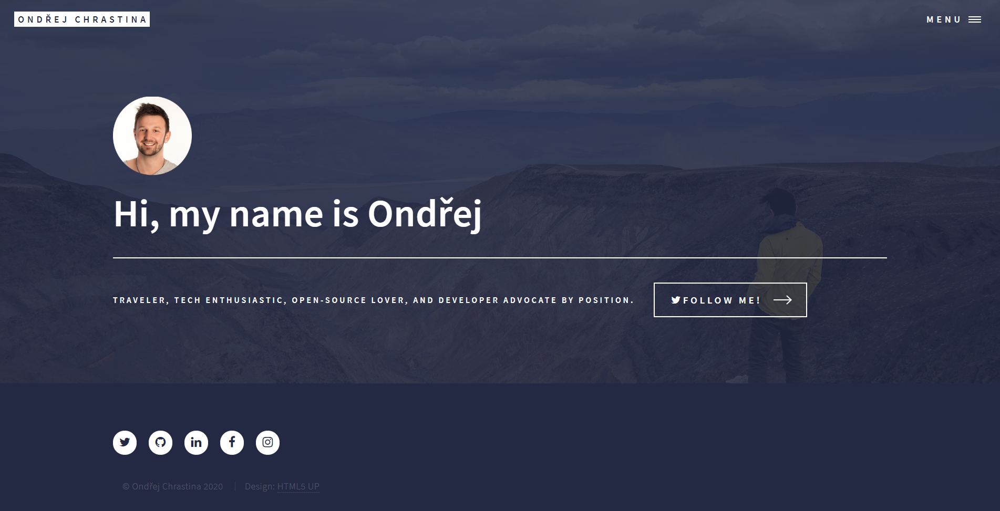

# Personal site

[](https://app.netlify.com/sites/chrastina/deploys)

This is my personal website build using [Gatsby](https://gatsbyjs.org) and [Kentico Kontent](https://kontent.ai) as a data source.

[](https://ondrej.chrastina.tech)

## Installation

Install required modules by `npm install` command.

Copy [`.env.template`](`./.env.template`) and name it `.env`.
That file will be used to load environment variables.

Run `gatsby develop` in the terminal to start the dev site.

## CSS Grid

The grid on this site was replaced with a custom version, built using CSS Grid. It's a very simple 12 column grid that is disabled on mobile. To start using the grid, wrap the desired items with `grid-wrapper`. Items inside the `grid-wrapper` use the class `col-` followed by a number, which should add up to 12.

Here is an example of using the grid, for a 3 column layout:

```jsx
<div className="grid-wrapper">
    <div className="col-4">
        <p>Content Here</p>
    </div>
    <div className="col-4">
        <p>Content Here</p>
    </div>
    <div className="col-4">
        <p>Content Here</p>
    </div>
</div>
```

## Style guide

You could find out the style guide on:

* [/style-guide](https://ondrej.chrastina.tech/style-guide) - Home page style showcase
* [/styleguide/elements](https://ondrej.chrastina.tech/style-guide/elements) - elements style guide
* [/styleguide/generic](https://ondrej.chrastina.tech/style-guide/generic) - generic page showcase
* [/styleguide/landing](https://ondrej.chrastina.tech/style-guide/landing) - landing page showcase
* [/styleguide/sections](https://ondrej.chrastina.tech/style-guide/sections) - sections page showcase

## Connect to your own project

### Create content source

1. Go to [app.kontent.ai](https://app.kontent.ai) and [create empty project](https://docs.kontent.ai/tutorials/set-up-kontent/projects/manage-projects#a-creating-projects)
1. Go to "Project Settings", select API keys and copy `Project ID`
1. Install [Kontent Backup Manager](https://github.com/Kentico/kontent-backup-manager-js) and import data to newly created project from [`kontent-backup.zip`](./kontent-backup.zip) file (place appropriate values for `apiKey` and `projectId` arguments):

    ```sh
    npm i -g @kentico/kontent-backup-manager

    kbm --action=restore --apiKey=<Management API key> --projectId=<Project ID> --zipFilename=kontent-backup
    ```

    > Alternatively, you can use the [Template Manager UI](https://kentico.github.io/kontent-template-manager/import-from-file) for importing the content.

1. Go to your Kontent project and [publish all the imported items](https://docs.kontent.ai/tutorials/write-and-collaborate/publish-your-work/publish-content-items).

### Join codebase and content data

Adjust `.env` file by setting the `KONTENT_PROJECT_ID` environment variable to value from your kontent project -> "Project Settings" ->  API keys -> Project ID.

**You are now ready to use the site as your own!**

## Setup

Site's navigation is based on the [official navigation showcase](https://github.com/Kentico/gatsby-source-packages/examples/navigation). It is also extending some concepts.

### External URLs in Navigation

The navigation item is extended by `External URL` field. [This field is then used instead of `url` field](./src/components/Menu.js).


### Multiple content pages

There are multiple content pages used as the content container. Namely `Home page`, `Sections page`, `Listing page`. These content containers are using [different templates](./gatsby-node.js) when registering the page components under the routes ([templates](./src/templates)).


#### Listing content page

One of the content container types is `Listing items`, this type allows to select content type(s) that is/are then used to determine what is about to be queried in the page. To model it in Kontent [Type selector custom element](https://github.com/Simply007/kontent-custom-element-type-selector) is used and then in the application. Then when the application is registering the page components ir loads detail items and [register them under their own route](./gatsby-node.js#L115) with [detail component template](./src/templates/journal-item.js).

In this case it its `journal/<GOTCHA_SLUG>`


